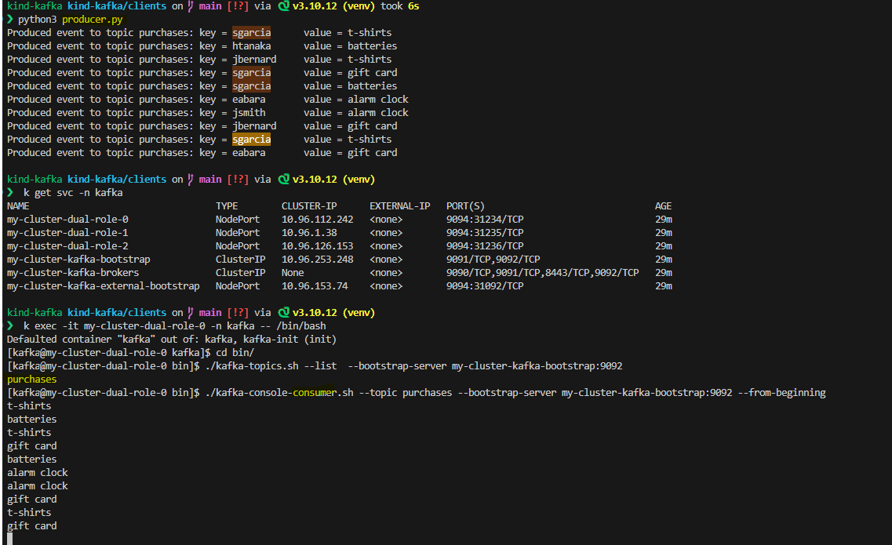

## Kind Setup 

```bash
kubectl create -f 'https://strimzi.io/install/latest?namespace=kafka' -n kafka

kubectl apply -f https://strimzi.io/examples/latest/kafka/kraft/kafka-single-node.yaml -n kafka 


❯  k exec -it my-cluster-dual-role-0 -n kafka -- /bin/bash
Defaulted container "kafka" out of: kafka, kafka-init (init)
[kafka@my-cluster-dual-role-0 kafka]$ cd bin/
[kafka@my-cluster-dual-role-0 bin]$ ./kafka-topics.sh --list  --bootstrap-server my-cluster-kafka-bootstrap:9092
purchases
[kafka@my-cluster-dual-role-0 bin]$ ./kafka-console-consumer.sh --topic purchases --bootstrap-server my-cluster-kafka-bootstrap:9092 --from-beginning
t-shirts
batteries
t-shirts
gift card
batteries
alarm clock
alarm clock
gift card
t-shirts
gift card


```




## Validate Operator -  Running status 

```bash
❯ kubectl -n kafka get pods,svc,deployment
NAME                                            READY   STATUS    RESTARTS   AGE
pod/strimzi-cluster-operator-76b947897f-gg8zk   1/1     Running   0          15m

NAME                                       READY   UP-TO-DATE   AVAILABLE   AGE
deployment.apps/strimzi-cluster-operator   1/1     1            1           58m


## command below will enable the KRaft feature in the operator eventually restarts it.
kubectl -n kafka set env deployment/strimzi-cluster-operator STRIMZI_FEATURE_GATES=+UseKRaft

```


## Kafka Commands :


### List all topics in a kafka cluster 


Exec into one of the brokers 
```bash
 k exec -it -n kafka kafka-0 -- bash
```

List 
```bash
root@kafka-0:/# kafka-topics.sh --list   --bootstrap-server kafka-svc:9092
__consumer_offsets
my-topic
nadav_topic
single-rf
root@kafka-0:/#
```


### Producer consumer example :

Producer :
```bash
root@kafka-1:/# kafka-console-producer.sh  --bootstrap-server kafka-svc:9092 --topic my-topic
>Hi there dear consumre 
>
```

Consumer  :
```bash
root@kafka-0:/# kafka-console-consumer.sh --bootstrap-server kafka-svc:9092 --topic my-topic
Hi there dear consumre 
```
---


### Create topic with simge replicatoin factor and describe it 
```bash
root@kafka-0:/# kafka-topics.sh --create  --topic single-rf --replication-factor 1   --bootstrap-server kafka-svc:9092
Created topic single-rf.
root@kafka-0:/# kafka-topics.sh --list  --bootstrap-server kafka-svc:9092
__consumer_offsets
my-topic
nadav_topic
single-rf
root@kafka-0:/# kafka-topics.sh --describe --topic single-rf  --bootstrap-server kafka-svc:9092
Topic: single-rf        TopicId: tPfr4QGPR_uV-02syX_SNQ PartitionCount: 1       ReplicationFactor: 1    Configs: min.insync.replicas=2,segment.bytes=1073741824
        Topic: single-rf        Partition: 0    Leader: 1       Replicas: 1     Isr: 1
root@kafka-0:/#
```
---


## Kafka Console Producer

### Create Topic with one partition 
```
root@kafka-0:/# kafka-topics.sh --bootstrap-server  kafka-svc:9092 --topic first_topic --create --partitions 1^C
```

### describe
```bash
root@kafka-0:/# kafka-topics.sh --bootstrap-server  kafka-svc:9092 --describe  --topic first_topic    
Topic: first_topic      TopicId: S1bvnFfXSCmuecLgvMsunQ PartitionCount: 1       ReplicationFactor: 3    Configs: min.insync.replicas=2,segment.bytes=1073741824
        Topic: first_topic      Partition: 0    Leader: 2       Replicas: 2,0,1 Isr: 2,0,1
```


### Produce messages 
```
root@kafka-0:/# kafka-topics.sh --bootstrap-server  kafka-svc:9092 --describe  --topic first_topic    
Topic: first_topic      TopicId: S1bvnFfXSCmuecLgvMsunQ PartitionCount: 1       ReplicationFactor: 3    Configs: min.insync.replicas=2,segment.bytes=1073741824
        Topic: first_topic      Partition: 0    Leader: 2       Replicas: 2,0,1 Isr: 2,0,1
root@kafka-0:/# kafka-console-producer.sh --bootstrap-server  kafka-svc:9092 --topic first_topic 
>Hello Worl
>I love Cats
>^Croot@kafka-0:/# 
root@kafka-0:/# 
^C
root@kafka-0:/# ^C
root@kafka-0:/# kafka-console-producer.sh --bootstrap-server  kafka-svc:9092 --topic first_topic --producer-property acks=all
>message that is  acked
>lernning !
>^Croot@kafka-0:/# 
```
### producing to a non existing topic
```bash
root@kafka-0:/# kafka-console-producer.sh --bootstrap-server  kafka-svc:9092 --topic new_topic
>kuku
[2025-01-06 12:14:33,639] WARN [Producer clientId=console-producer] Error while fetching metadata with correlation id 3 : {new_topic=UNKNOWN_TOPIC_OR_PARTITION} (org.apache.kafka.clients.NetworkClient)
[2025-01-06 12:14:33,741] WARN [Producer clientId=console-producer] Error while fetching metadata with correlation id 4 : {new_topic=UNKNOWN_TOPIC_OR_PARTITION} (org.apache.kafka.clients.NetworkClient)
[2025-01-06 12:14:33,844] WARN [Producer clientId=console-producer] Error while fetching metadata with correlation id 5 : {new_topic=UNKNOWN_TOPIC_OR_PARTITION} (org.apache.kafka.clients.NetworkClient)
[2025-01-06 12:14:33,946] WARN [Producer clientId=console-producer] Error while fetching metadata with correlation id 6 : {new_topic=UNKNOWN_TOPIC_OR_PARTITION} (org.apache.kafka.clients.NetworkClient)
[2025-01-06 12:14:34,048] WARN [Producer clientId=console-producer] Error while fetching metadata with correlation id 7 : {new_topic=UNKNOWN_TOPIC_OR_PARTITION} (org.apache.kafka.clients.NetworkClient)
[2025-01-06 12:14:34,150] WARN [Producer clientId=console-producer] Error while fetching metadata with correlation id 8 : {new_topic=UNKNOWN_TOPIC_OR_PARTITION} (org.apache.kafka.clients.NetworkClient)
>

```

### produce with keys
```bash
root@kafka-0:/# kafka-console-producer.sh  --bootstrap-server kafka-svc:9092  --topic first_topic --property parse.key=true --property key.separator=:
>example-key:example-value
>name:nadav
>^Croot@kafka-0:/# 
root@kafka-0:/# kafka-topics.sh --bootstrap-server  kafka-svc:9092 --describe  --topic first_topic    
Topic: first_topic      TopicId: S1bvnFfXSCmuecLgvMsunQ PartitionCount: 1       ReplicationFactor: 3    Configs: min.insync.replicas=2,segment.bytes=1073741824
        Topic: first_topic      Partition: 0    Leader: 2       Replicas: 2,0,1 Isr: 2,0,1
root@kafka-0:/# kafka-console-consumer.sh --bootstrap-server kafka-svc:9092 --topic first_topic --from-beginning --property print.key=true --property key.separator=:
null:Hello Worl
null:I love Cats
null:message that is  acked
null:lernning !
example-key:example-value
name:nadav
```
---


## Kafka Console Consumer


We can see in the example below we created a Topic with 3 partition and ther default 3 replication factor and the partition  the distribution 
```bash
root@kafka-0:/# kafka-topics.sh  --bootstrap-server  kafka-svc:9092 --topic second_topic --create --partitions 3
WARNING: Due to limitations in metric names, topics with a period ('.') or underscore ('_') could collide. To avoid issues it is best to use either, but not both.
Created topic second_topic.
root@kafka-0:/# kafka-topics.sh --bootstrap-server  kafka-svc:9092 --describe  --topic second_topic    
Topic: second_topic     TopicId: 8Buvy0k8TXGFFekFF2flGw PartitionCount: 3       ReplicationFactor: 3    Configs: min.insync.replicas=2,segment.bytes=1073741824
        Topic: second_topic     Partition: 0    Leader: 2       Replicas: 2,0,1 Isr: 2,0,1
        Topic: second_topic     Partition: 1    Leader: 0       Replicas: 0,1,2 Isr: 0,1,2
        Topic: second_topic     Partition: 2    Leader: 1       Replicas: 1,2,0 Isr: 1,2,0
root@kafka-0:/# 
```


A simpler example (round robin ...) a Topic with 1 replicaiton factor and 3 partitions :


```bass
root@kafka-0:/# kafka-topics.sh --list   --bootstrap-server kafka-svc:9092
__consumer_offsets
first_topic
my-topic
nadav_topic
new_topic
single-rf
root@kafka-0:/# kafka-topics.sh --create  --bootstrap-server  kafka-svc:9092  --replication-factor 1  --topic second_topic --partitions 3
WARNING: Due to limitations in metric names, topics with a period ('.') or underscore ('_') could collide. To avoid issues it is best to use either, but not both.
Created topic second_topic.
root@kafka-0:/# kafka-topics.sh --bootstrap-server  kafka-svc:9092 --describe   --topic second_topic  
Topic: second_topic     TopicId: pmWFvQeuSf2s-zJUsny2nw PartitionCount: 3       ReplicationFactor: 1    Configs: min.insync.replicas=2,segment.bytes=1073741824
        Topic: second_topic     Partition: 0    Leader: 0       Replicas: 0     Isr: 0
        Topic: second_topic     Partition: 1    Leader: 1       Replicas: 1     Isr: 1
        Topic: second_topic     Partition: 2    Leader: 2       Replicas: 2     Isr: 2
root@kafka-0:/# 

```


Reciving data :


```bash
root@kafka-0:/# kafka-console-consumer.sh  --bootstrap-server  kafka-svc:9092 --topic second_topic
1
2
3
4
5
^CProcessed a total of 5 messages
root@kafka-0:/# kafka-console-consumer.sh  --bootstrap-server  kafka-svc:9092 --topic second_topic --from-beginning
2
5
1
4
3
```


## display key, values and timestamp in consumer
```bash
kafka-console-consumer.sh  --bootstrap-server  kafka-svc:9092 --topic second_topic --formatter kafka.tools.DefaultMessageFormatter --property print.timestamp=true --property print.key=true --property print.value=true --property print.partition=true --from-beginning
```
Output
```bash
root@kafka-0:/kafka-console-consumer.sh  --bootstrap-server  kafka-svc:9092 --topic second_topic --formatter kafka.tools.DefaultMessageFormatter --property print.timestamp=true --property print.key=true --property print.value=true --property print.partition=true --from-beginningng
CreateTime:1736167759241        Partition:0     null    3
CreateTime:1736167757049        Partition:1     null    1
CreateTime:1736167759924        Partition:1     null    4
CreateTime:1736167758253        Partition:2     null    2
CreateTime:1736167760336        Partition:2     null    5

```


Consumers Group in action 


